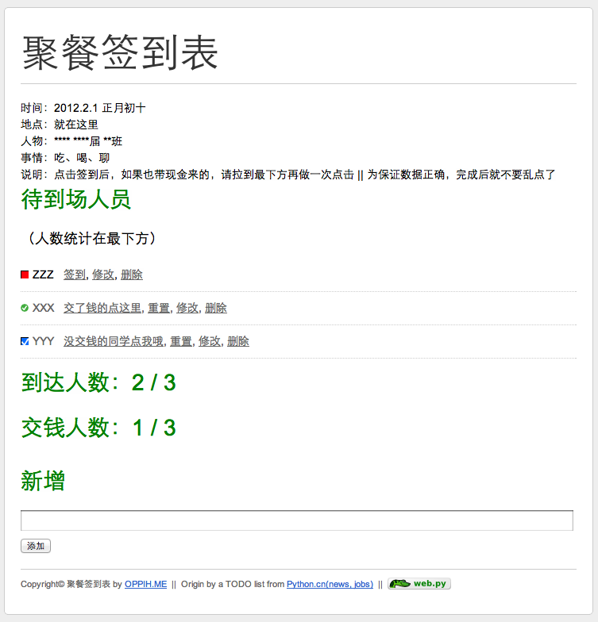

# Simple ToCome

a simple webpy project to track who has came to the party.

Source cloned from <https://bitbucket.org/qichangxing/simple-todo/>

And you can get more info about the source at <http://simple-is-better.com/news/309>

I'm using it to make out a simple site for my friends-meet party.

Details can be update in config/settings.py

## IMPROVE IT:

- Put "people_arrived / people_all" up place(by CSS?).
- Change the database to sqlite3 for fast and easy deployment.

## HOW TO DEPLOY (on localhost:8080):

1. Setup your MySQL server properly.
2. (Use virtualenv to) `pip install **mysql-python web.py**`
3. Create a database named "tocome" in MySQL and then import the **static/sql/tocome.sql** into your MySQL server :

	`mysql>CREATE DATABASE tocome;`  
	`exit`  
	`$ mysql -uroot tocome < tocome.sql`

4. Run "python code.py" in your console and visit http://127.0.0.1:8080 .

## 中文说明：

一个简单的班级聚餐签到程序，根据 simple-is-beter.com 上面的 web.py TODO LIST 示例程序修改而成。

在原有的逻辑上增加了一个CLASS用于记录参与聚餐的同学是不是给生活委员交了钱。。。

另外在下方增加了两个人数统计。

聚会信息说明可在 **config/settings.py** 中修改

效果图在此(如果你clone下代码再在本地使用可视化markdown编辑工具打开就能看到)：
simple_tocome_example.png

